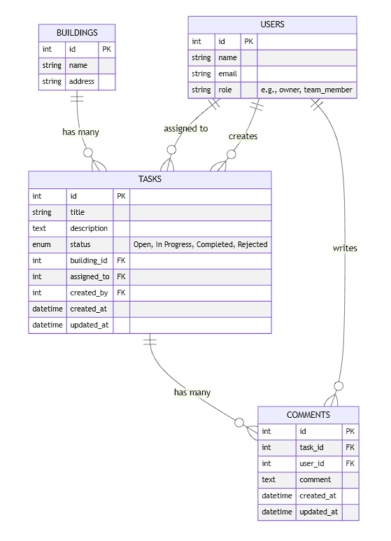
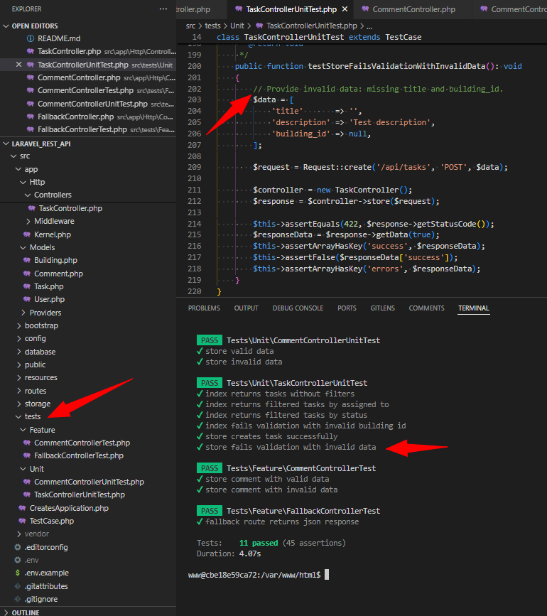

<pre>
  _____           _              _____ _____ 
 |  __ \         | |       /\   |  __ \_   _|
 | |__) |___  ___| |_     /  \  | |__) || |  
 |  _  // _ \/ __| __|   / /\ \ |  ___/ | |  
 | | \ \  __/\__ \ |_   / ____ \| |    _| |_ 
 |_|  \_\___||___/\__| /_/    \_\_|   |_____|
                                             
| Using Laravel 10 by Henrique Soares Barbosa |
</pre>

# Laravel REST API

A REST API built with Laravel 10 as an assessment project.

## Table of Contents

- [Overview](#overview)
- [Deployment Instructions](#deployment-instructions)
  - [Requirements](#requirements)
  - [Setup Steps](#setup-steps)
- [Accessing the Application](#accessing-the-application)
- [Optional Configurations](#optional-configurations)
- [Entity Relationship Diagram (ERD)](#entity-relationship-diagram-erd)

## Overview

This project is a REST API built using Laravel 10. The application is fully containerized using Docker and Docker Compose, ensuring all dependencies are bundled together for a smooth deployment experience.

## Deployment Instructions

### Requirements

- Docker and Docker Compose: These are the only requirements as all services are containerized.

### Setup Steps

1. Clone the Repository:

```bash
git clone https://github.com/softlivre/laravel_rest_API.git
```

2. Configure Environment Variables:

- In the project root, copy .env.example to .env:

```bash
cp .env.example .env
```
- In the src directory, also copy .env.example to .env: (!IMPORTANT!)

```bash
cd src  
cp .env.example .env
```

3. Build and Start the Containers:

- Run the following command in the root directory to build all necessary containers and start the services:

```bash
docker-compose up -d --build
```
!IMPORTANT! only run "docker-compose up -d --build" after you have set the two .env files. Failure to do so will result in an error as we need the database name to match the one in the .env file.

4. Set Up the Application:

- Enter the app container and execute the following commands:

```bash
# Enter the app container  
docker compose exec app bash

composer install --prefer-dist --optimize-autoloader  
php artisan key:generate  
php artisan migrate:fresh --seed
```

## Accessing the Application

- API: http://localhost:85
- Adminer: http://localhost:8080
- pgAdmin: http://localhost:5050

**I have used port 85 for the API** to avoid conflicts with other services running on the default port 80.

## Optional Configurations

### Configuring pgAdmin and Adminer

To configure pgAdmin, add a new server with the following credentials:

- Host: PostgreSQL container IP  
  (You can find it using: docker inspect henriquebarbosa-db | grep IPAddress)
- Port: 5432
- Username: pguser
- Password: pgpass

You may use the same obtained IP if you prefer using Adminer instead of pgAdmin.

## Entity Relationship Diagram (ERD)

Below is the Entity Relationship Diagram for the database schema:



(Generated using Mermaid Live: https://mermaid.live)

## Unit and Feature Tests

Code has been covered and tested with PHPUnit. To run the tests, enter the app container and execute the following command:

```bash
php artisan test
```



## draft area @TODO xxxxxxxxxxxxxxxxxxxxxxxxxxxxxxxxxxxxxxxxx

composer create-project "laravel/laravel:^10.0" .

cp .env.example .env
composer install --prefer-dist --optimize-autoloader
php artisan key:generate 
php artisan migrate:fresh --seed
